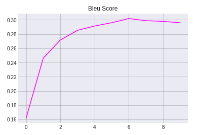

# NLP Evaluation Metrics 

### Part 1 : Recall, Precision, and F1 Score

### Use case : Sentiment classification on IMDB dataset

Machine learning model to detect sentiment of movie reviews from IMDb dataset using PyTorch and TorchText. 

👉 Please click here for code file - [sentiment classification](https://github.com/krishnarevi/NLP_Evaluation_Metrics/blob/main/Part1_Classification_metrics.ipynb)

### Evaluation Metrics used : Accuracy , Precision ,Recall , F1 score 

**Accuracy**

Accuracy is the most intuitive performance measure and it is simply a ratio of correctly predicted observation to the total observations. One may think that, if we have high accuracy then our model is best. Yes, accuracy is a great measure but only when you have symmetric datasets where values of false positive and false negatives are almost same. 

Example code :

```python
>>> import torch
>>> from torchmetrics.functional import accuracy
>>> target = torch.tensor([0, 1, 2, 3])
>>> preds = torch.tensor([0, 2, 1, 3])
>>> accuracy(preds, target)
tensor(0.5000)
```

##### Precision

Precision attempts to answer the following question:

> What proportion of positive identifications was actually correct?

Precision is defined as follows:


It is the ‘Exactness’, ability of the model to return only relevant instances. If your use case/problem statement involves minimizing the False Positives, then Precision is something you need.

A model that produces no false positives has a precision of 1.0.

Example code  :

```python
>>> from torchmetrics.functional import precision
>>> preds  = torch.tensor([2, 0, 2, 1])
>>> target = torch.tensor([1, 1, 2, 0])
>>> precision(preds, target, average='macro', num_classes=3)
tensor(0.1667)
>>> precision(preds, target, average='micro')
tensor(0.2500)
```


**Recall** 

Recall attempts to answer the following question:

> What proportion of actual positives was identified correctly?

Mathematically, recall is defined as follows:


It is the ‘Completeness’, ability of the model to identify all relevant instances, True Positive Rate, aka Sensitivity. In the current scenario if your focus is to have the least False Negatives then Recall can come to your rescue.

A model that produces no false negatives has a recall of 1.0.

Example code :

```python
>>> from torchmetrics.functional import recall
>>> preds  = torch.tensor([2, 0, 2, 1])
>>> target = torch.tensor([1, 1, 2, 0])
>>> recall(preds, target, average='macro', num_classes=3)
tensor(0.3333)
>>> recall(preds, target, average='micro')
tensor(0.2500)
```

**F1 score**

F1 score is the harmonic mean of precision and recall. F1 is a useful metric if you're looking for a balance between precision and recall and there's an uneven class distribution.

F1 score can be defined as :


Example code :

```python
>>> from torchmetrics.functional import f1
>>> target = torch.tensor([0, 1, 2, 0, 1, 2])
>>> preds = torch.tensor([0, 2, 1, 0, 0, 1])
>>> f1(preds, target, num_classes=3)
tensor(0.3333)
```


Train  logs


**Train and validation loss**


Here we observe minimum training loss of .025 and minimum validation loss of .33.Our training loss is gradually decreasing and that is good ,but our validation loss starts to increase after decreasing for initial few epochs. This could be due to our model's overfitting on training data , we could try adding regularization and reduction in model complexity to overcome this. 

 **Train and validation accuracy**


Here we observe that our train accuracy is improving, but validation accuracy is constant  after few initial epochs. Our training accuracy is around 99 % while best validation accuracy is 87.97 %. We got high accuracy that is good ,but the gap between training and validation accuracy is a clear indication of overfitting. The larger the gap, the higher the overfitting. 

**Train and validation precision**


Precision is the ratio between the True Positives and all the Positives. For our problem statement, that would be the measure of reviews that we correctly identify as positive out of all the positive reviews.

What is the Precision for our model? Yes, it is 0.89 or, when it predicts that a review is positive, it is correct around 89% of the time.

**Train and validation recall**


The recall is the measure of our model correctly identifying True Positives. Thus, for all the reviews that are actually positive, recall tells us how many we correctly identified as positive. For our model, Recall = 0.88,which is pretty good. Recall also gives a measure of how accurately our model is able to identify the relevant data. We refer to it as Sensitivity or True Positive Rate.

**Train and validation F1 score**


Here F1 score is ~ 0.88 ,which is pretty good and similar to accuracy what we have .F1 Score is the weighted average of Precision and Recall. Therefore, this score takes both false positives and false negatives into account.

**Summery of evaluation**  :

 F1 is usually more useful than accuracy, especially if you have an uneven class distribution. Accuracy works best if false positives and false negatives have similar cost. If the cost of false positives and false negatives are very different, it’s better to look at both Precision and Recall. Here we have equal number of positive an negative reviews in our case . Also cost of false positives and negatives are also similar . We can either look into accuracy or F1 score to evaluate our model . Anyway in both cases we have more than 85% , which is good !!

**Sample predictions**


### Part 2&3 : BLEU 

### Use case : German to English translation model 

👉 Please click here for code file - [German-English translation model]https://github.com/krishnarevi/NLP_Evaluation_Metrics/blob/main/Part2_BleuScore_PPL.ipynb)

###### Evaluation Metrics used : Bleu Score, Perplexity 

**About Bleu Score :**

[BLEU (**B**i**L**ingual **E**valuation **U**nderstudy)](https://en.wikipedia.org/wiki/BLEU) is a metric for automatically evaluating machine-translated text. The BLEU score is a number between zero and one that measures the similarity of the machine-translated text to a set of high quality reference translations. A value of 0 means that the machine-translated output has no overlap with the reference translation (low quality) while a value of 1 means there is perfect overlap with the reference translations (high quality).

It has been shown that BLEU scores correlate well with human judgment of translation quality. Note that even human translators do not achieve a perfect score of 1.0.

Trying to compare BLEU scores across different corpora and languages is strongly discouraged. Even comparing BLEU scores for the same corpus but with different numbers of reference translations can be highly misleading.

However, as a rough guideline, the following interpretation of BLEU scores (expressed as percentages rather than decimals) might be helpful.


As per [this](https://www.researchgate.net/publication/282133384_Neural-based_Machine_Translation_for_Medical_Text_Domain_Based_on_European_Medicines_Agency_Leaflet_Texts)  research paper following color gradient can be used as a general scale interpretation of the BLEU score


Example code:

```python
>>> from torchmetrics.functional import bleu_score
>>> translate_corpus = ['the cat is on the mat'.split()]
>>> reference_corpus = [['there is a cat on the mat'.split(), 'a cat is on the mat'.split()]]
>>> bleu_score(translate_corpus, reference_corpus)
tensor(0.7598)
```

Sample: 

Reference : “the Iraqi weapons are to be handed over to the army within two weeks” 

MT output : “in two weeks Iraq’s weapons will give army” 

BLUE metric: 

- 1-gram precision: 4/8 
- 2-gram precision: 1/7 
- 3-gram precision: 0/6 
- 4-gram precision: 0/5 
- BLEU score = 0 (weighted geometric average)

**About Perplexity :**

In general, perplexity is a measurement of how well a probability model predicts a sample. Perplexity (PPL) is one of the most common metrics for evaluating language models

Perplexity is defined as the exponentiated average negative log-likelihood of a sequence. If we have a tokenized sequence X=(x0,x1,…,xt) then the perplexity of X is,


​		

where   $\log p_\theta (x_i|x_{<i})$ is the log-likelihood of the ith token conditioned on the preceding tokens $x_{<i}$ according to our model. Intuitively, it can be thought of as an evaluation of the model’s ability to predict uniformly among the set of specified tokens in a corpus. Importantly, this means that the tokenization procedure has a direct impact on a model’s perplexity which should always be taken into consideration when comparing different models.

This is also equivalent to the exponentiation of the cross-entropy between the data and model predictions


**Train logs**


**Train and validation loss**


Here we observe our training loss keep on decreasing ,which is good but validation loss increases after dip in some initial epochs .This could be due to our model is overfitting to the training data. We can try adding regularization and reducing model capacity. Our minimum validation loss is 3.5 and train loss is 1.05


**Train and validation perplexity**


Intuitively, Perplexity can be thought of as an evaluation of the model’s ability to predict uniformly among the set of specified tokens in a corpus. Smaller the perplexity better the model . Here we can observe perplexity for train set keep on decreasing ,which is good. But for validation set it increases after dip in some initial epochs . This might be due to overfitting of our model on training data

**Bleu score**



The most useful part of a BLEU score is that it can be used to compare different models on the same dataset, where the one with the **higher** BLEU score is "better".We have our best validation Bleu score over 30 . According to general interpretability scale published in [this](https://www.researchgate.net/publication/282133384_Neural-based_Machine_Translation_for_Medical_Text_Domain_Based_on_European_Medicines_Agency_Leaflet_Texts) paper scores over 30 generally reflect understandable translations. So our model give understandable translations according to Bleu score and that's good !!

**Sample predictions** :


### Part 4 : BERTScore 

### Use case : German to English translation model

We would use the same use case we tried in part 2&3 to show case BERTScore 

👉 Please click here for code file - [German-English translation model](https://github.com/krishnarevi/NLP_Evaluation_Metrics/blob/main/Part3_BertScore_PPL.ipynb)

###### Evaluation Metrics used : BERTScore

**BERTScore**

BERTScore leverages the pre-trained contextual embeddings from BERT and matches words in candidate and reference sentences by cosine similarity. It has been shown to correlate with human judgment on sentence-level and system-level evaluation. Moreover, BERTScore computes precision, recall, and F1 measure, which can be useful for evaluating different language generation tasks.

For an illustration, BERTScore recall can be computed as :


The outputs of the `score` function are Tensors of precision, recall, and F1 respectively. Each Tensor has the same number of items with the candidate and reference lists. Each item in the list is a scalar, representing the score for the corresponding candidates and references. We can take the average of all candidate reference pairs to be the system level score.

**Train logs**


Loss and Perplexity of both train and validation set is consistently decreasing which is good and shows our model is learning .

**Average F1,** **Average Recall**,**Average Precision**

| F1 score | Recall | Precision | Loss  | PPL    |
| -------- | ------ | --------- | ----- | ------ |
| 0.9208   | 0.9264 | 0.9153    | 3.261 | 26.080 |
|          |        |           |       |        |

Our model achieved  average precision , recall , F1 scores above .90 just with 5 epochs on  test data set , which is really great !!!

**BertScore Plot example**

`bert_score` also provides a convenient function `plot_example` to support sentence-level visualization by plotting the pairwise cosine similarity.

Predicted sentence : ['die', 'person', 'im', 'gestreiften', 'shirt', 'klettert', 'auf', 'einen', 'berg', '.']

Target sentence :  ['the', 'person', 'in', 'the', 'striped', 'shirt', 'is', 'mountain', 'climbing', '.']

Pairwise cosine similarity  of above predicted and target sentence :


